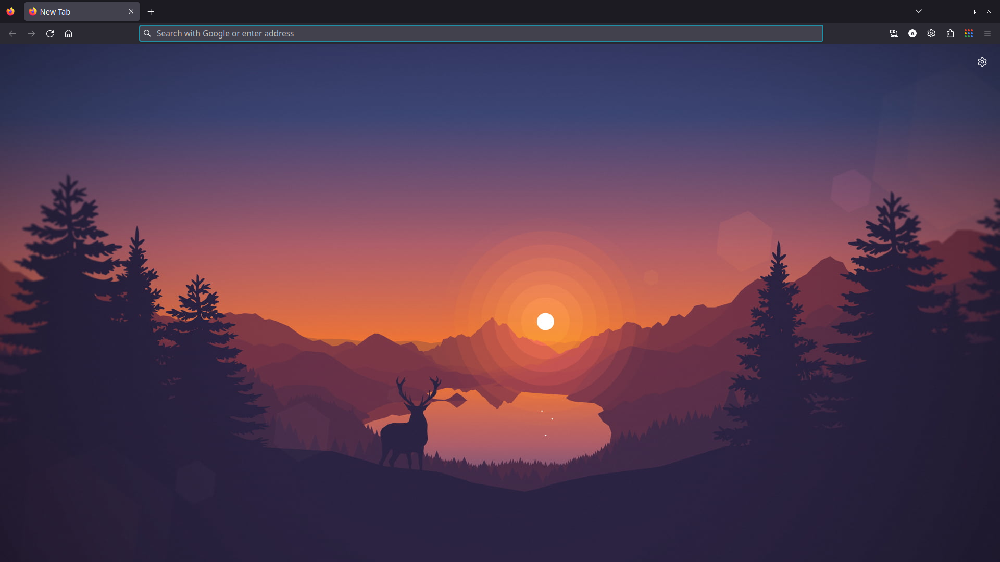
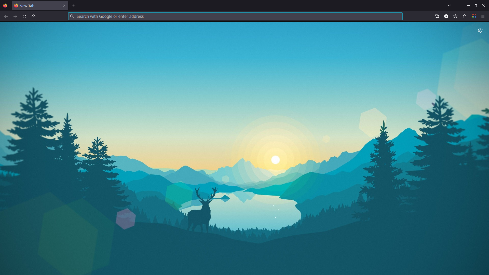
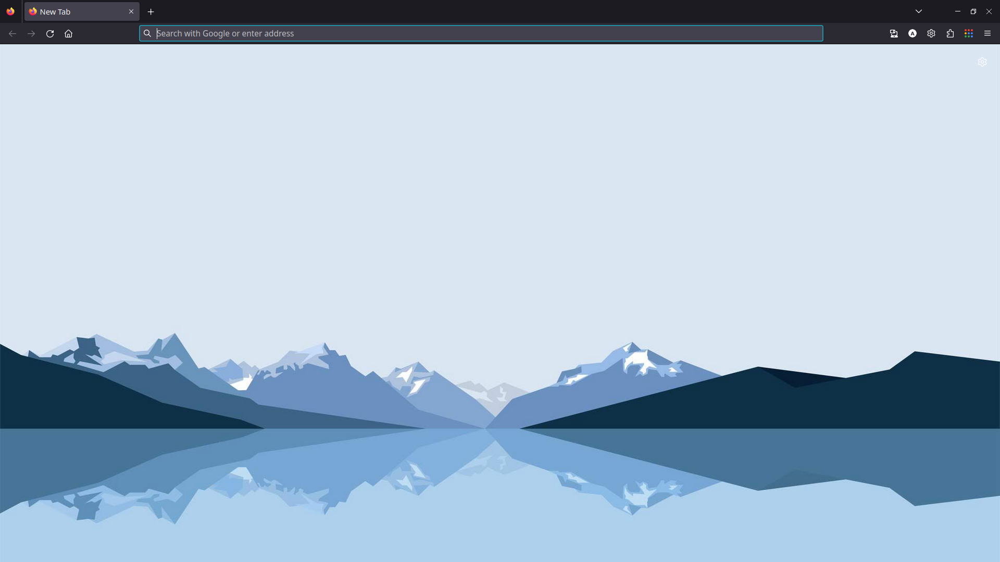
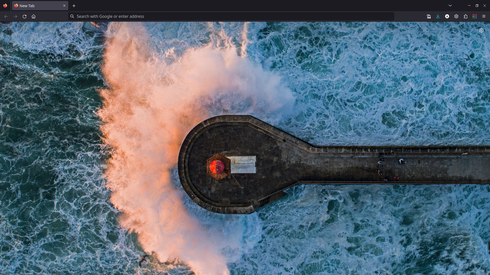

# Firefox Background Change 

Changing the default firefox background image on the home page to a custom image.

<div style="display: flex; flex-direction: row;">
   
   &nbsp;&nbsp;&nbsp;
   
</div>
&nbsp;
<div style="display: flex; flex-direction: row;">
   
   &nbsp;&nbsp;&nbsp;
   
</div>

## Home page setup

1. Go to Settings -> Home.

2. Under `Firefox Home Content` unselect all the checkboxes (or as per your preference).

3. Hide the bookmarks toolbar by pressing <kbd>Ctrl</kbd> + <kbd>Shift</kbd> + <kbd>B</kbd> .

## Steps for configuring the background

1. Open firefox browser and in the search panel enter : `about:support` .

2. Open the directory under the name of `Profile directory` .
   By either clicking on `Open directory` or opening the path in the terminal.

3. In the `Profile directory`, open terminal and type the following commands :

   ```bash
     mkdir chrome
     cd chrome
     touch userContent.css
     mkdir img
   ```

4. Copy the contents from [here](https://github.com/Aadmi1234/firefox-bg-config/blob/master/userContent.css) to the `userContent.css` file.

5. Add the desired image to the `img` directory. The background used in the wallpaper are included in the `public` directory of this repository.

   > [!IMPORTANT]
   > The image must only be in JPG format.

6. Change the url field in the css file to relative path of the desired wallpaper.

7. Go to the url `about:config` , accept the risk, and search for `toolkit.legacyUserProfileCustomizations.stylesheets`, and set the value to **true**. This tells Firefox to load the CSS file at startup.

8. Restart Firefox.
